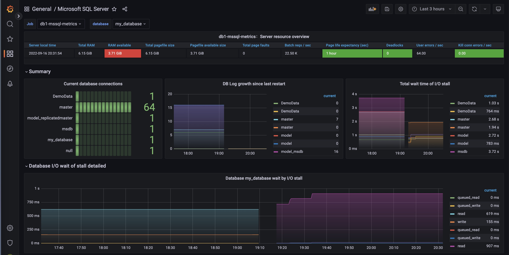
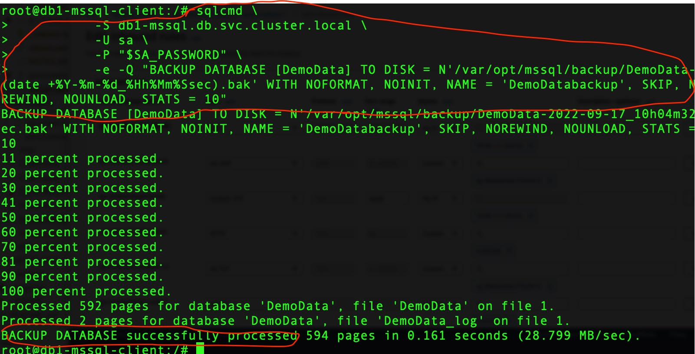
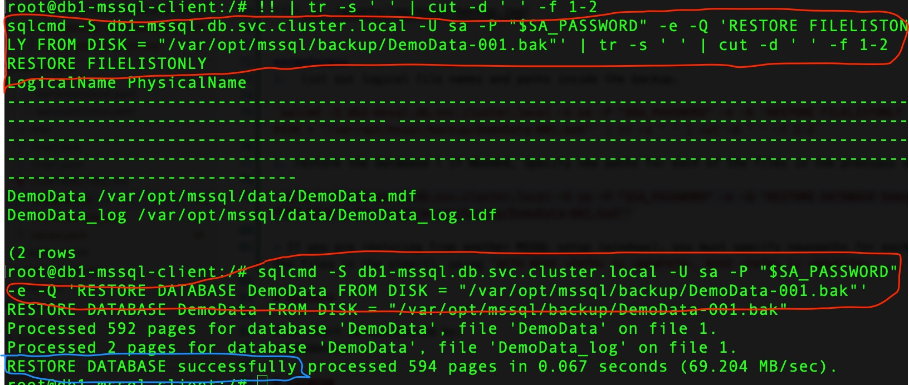

# MS SQL Packaged By Elm
Microsoft SQL Server is still used by many organizations. And migration to Cloud native can be a blocked by having this technology.
In order to help organization to lift-shift to Cloud Native, they can run also MS SQL in kubernetes via this Helm chart

> **DISCLAIMER**
> BY DEPLOYING THIS HELM CHART, YOU ARE ACCEPTING THE [END-USER Licensing Agreement of Microsoft SQL Server](https://go.microsoft.com/fwlink/?LinkId=746388)

# TL;DR
```sh
helm repo add elm https://raw.githubusercontent.com/ElmCompany/helm-charts/gh-pages
helm install my-db elm/mssql
```

# Values

Check default Values of this chart [here](https://github.com/ElmCompany/helm-charts/blob/master/charts/mssql/values.yaml) .

Hint:  It's almost identical to values schema of `bitnami/mysql` helm chart.

# Features

1. Applying Bitnami Helm Chart standards
   - Same interface (values.yaml schema ) as such bitnami/mysql helm chart values.
   - Ability to specify own registry
   - auto-generate passwords in not given
   - and more...
2. Persisting Data
3. Auto Bootstrapping Database
4. Auto Bootstraping Database Owner User with given password
5. Ability to execute initial DB scripts (SQL)
6. Performance Monitoring - Integrated with Prometheus Operator
7. Persistence for Backup
8. Replication Architecture [ TODO ]
9. TCP ingress for Database (traefik)

# Backup/restore

- Enable persistence for backups by setting (.Values.)`backup.persistence.enabled=true`


# Try Sample

Try with [values.sample.yaml](values.sample.yaml)
- Update `values.sample.yaml` as per your environment
- `helm -n db upgrade db1 elm/mssql -f values.sample.yaml -i --create-namespace`
- Connect to DB using MSSQL client as per guide available at `helm -n db get notes db1`
- Validate in your grafana dashboard


**Take backup**
- Connect to DB using MSSQL client as per guide available at `helm -n db get notes db1`
- Add test data before backup:
```sh
sqlcmd -S db1-mssql.db.svc.cluster.local -U sa -P "$SA_PASSWORD" -e -Q "USE DemoData
INSERT INTO [dbo].[Products] ([ID],[ProductName]) VALUES (7,'Test backup restore')
GO
"
```
- Get backup command from notes: `helm -n db get notes db1`
```sh
sqlcmd -S db1-mssql.db.svc.cluster.local -U sa -P "$SA_PASSWORD" -e -Q "BACKUP DATABASE [DemoData] TO DISK = N'/var/opt/mssql/backup/DemoData-001.bak' WITH NOFORMAT, NOINIT, NAME = 'DemoDatabackup', SKIP, NOREWIND, NOUNLOAD, STATS = 10"
```
- Delete database
```sh
sqlcmd -S db1-mssql.db.svc.cluster.local -U sa -P "$SA_PASSWORD" -e -Q "USE master
GO
ALTER DATABASE [DemoData] SET SINGLE_USER WITH ROLLBACK IMMEDIATE;
DROP DATABASE [DemoData]
GO
"
```



**restore**
1.  list out logical file names and paths inside the backup.

`sqlcmd -S db1-mssql.db.svc.cluster.local -U sa -P "$SA_PASSWORD" -e -Q 'RESTORE FILELISTONLY FROM DISK = "/var/opt/mssql/backup/DemoData-001.bak"' | tr -s ' ' | cut -d ' ' -f 1-2`

2. restore the database

`sqlcmd -S db1-mssql.db.svc.cluster.local -U sa -P "$SA_PASSWORD" -e -Q 'RESTORE DATABASE DemoData FROM DISK = "/var/opt/mssql/backup/DemoData-001.bak"'`

> If you are restoring from another MSSQL setup (windows), you must specify new paths for each of the files in the step(1), using `WITH MOVE <PATH> to <NEWPATH>, MOVE <PATH> to <NEWPATH>, ...`



# Release Notes

**1.4.0 (planned)**
- Support Repliction architecture (publisher, subscriber, distributor)
-
**1.3.x (latest)**
- Persisting Backups
- Taking backups automatically for the specified databases at the specified time/period.
- Providing restore CLI to restore EASILY backups taken automatically
- Extensive docs in README with e2e example
- Supporting TCP Ingress for Traefik-based ingress controllers.

**1.2.1**
- Ability to execute initial DB scripts (SQL) [ DONE ✅ ]
- Performance Monitoring - Integrated with Prometheus Operator [ DONE ✅ ]

**1.0.0**
- First Release
- Applying Bitnami Helm Chart standards [ DONE ✅ ] (Same interface (values.yaml schema ) as such bitnami/mysql .. so on)
- Auto Bootstrapping Database [ DONE ✅ ]
- Auto Bootstraping Database Owner User with given password [ DONE ✅ ]


# Authors

This chart is maintained by:
- @abdennour

# License

LGPL v3
